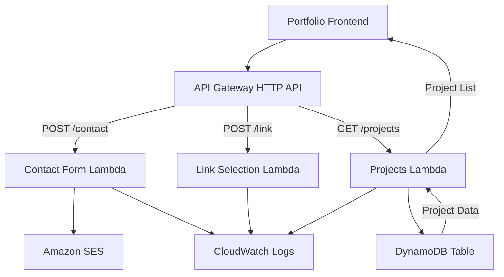

# Portfolio CloudFormation Project

[](https://github.com/chris-royall/portfolio-cloudformation/actions/workflows/deploy.yml)

This project contains CloudFormation templates and scripts to deploy AWS resources for a portfolio website backend.
The frontend application for this portfolio is available at [https://github.com/chris-royall/portfolio-reactapp](https://github.com/chris-royall/portfolio-reactapp)

## Table of Contents
- [Project Structure](#project-structure)
- [Architecture](#architecture)
- [Deployment Strategy](#deployment-strategy)
- [Deployment](#deployment)
- [API Endpoints](#api-endpoints)
- [Parameters](#parameters)
- [Lambda Functions](#lambda-functions)
- [Security Considerations](#security-considerations)

## Project Structure

```
portfolio-cloudformation/
├── .github/
│   └── workflows/
│       └── deploy.yml   # GitHub Actions deployment workflow
├── template.yaml        # Main CloudFormation template with API Gateway, Lambda functions
├── lambda/              # Lambda function code
│   ├── contact-form/    # Contact form Lambda function
│   │   └── lambda_function.py
│   ├── link-selection/  # Link selection Lambda function
│   │   └── lambda_function.py
│   └── projects/        # Projects Lambda function
│       └── lambda_function.py
├── deploy.sh            # Script to deploy CloudFormation stack
└── README.md            # Project documentation
```

## Architecture



This project deploys the following AWS resources:

1. **API Gateway (HTTP API)** - A single API with multiple routes:
   - `POST /contact` - Endpoint for contact form submissions
   - `POST /link` - Endpoint for link selection functionality
   - `GET /projects` - Endpoint for retrieving project data

2. **Lambda Functions**:
   - Contact Form Function - Processes contact form submissions and sends emails via SES
   - Link Selection Function - Handles link selection requests and logs user interactions
   - Projects Function - Retrieves project data from DynamoDB

3. **DynamoDB Table** - Stores project information with dynamic content management

4. **Custom Domain Mapping** - Maps the API to a custom domain at the `/v1` path

5. **IAM Roles and Policies**:
   - Lambda execution role with basic execution permissions
   - SES permissions for the contact form Lambda function
   - DynamoDB read permissions for the projects Lambda function

6. **CloudWatch Logs** - Configured with 7-day retention period for Lambda function logs

## Deployment Strategy

This project uses a single CloudFormation template deployment approach:

1. **CloudFormation Deployment**:
   - The CloudFormation template deploys all infrastructure (API Gateway, Lambda functions, IAM roles)
   - Lambda functions use inline code deployment
   - All resources are created in a single stack deployment

This approach provides several benefits:
- Simple single-template deployment
- No external dependencies
- Fast deployment process
- Self-contained infrastructure

## Deployment

### GitHub Actions Deployment

This project is configured for manual deployment using GitHub Actions. The workflow:
1. Checks out the code
2. Sets up AWS credentials using stored secrets
3. Makes deployment scripts executable
4. Deploys the CloudFormation stack to prod environment

## Lambda Functions

### Contact Form Function

The Contact Form Lambda function:
- Processes contact form submissions from the portfolio website
- Validates required fields (email and message)
- Sends emails using Amazon SES
- Implements proper error handling and logging
- Returns appropriate HTTP responses with CORS headers

### Link Selection Function

The Link Selection Function:
- Logs when users click on links in the portfolio website
- Records timestamp, button clicked, user agent, and source IP
- Implements CORS support for cross-origin requests
- Provides simple analytics for portfolio website usage

### Projects Function

The Projects Function:
- Retrieves project data from DynamoDB table
- Returns projects sorted by sort_id for consistent ordering
- Implements proper error handling and CORS support
- Enables dynamic content management for portfolio projects

## Security Considerations

This project implements several security measures:

1. **API Throttling**:
   - Global throttling limits for the API (configurable via parameters)
   - Route-specific throttling for individual endpoints (5 requests/second)

2. **Lambda Function Security**:
   - Reserved concurrency (5) to prevent function overload
   - Principle of least privilege for IAM permissions
   - Input validation for all user-provided data

3. **DynamoDB Security**:
   - Least privilege access for Lambda functions to DynamoDB
   - Pay-per-request billing mode to optimize costs

4. **CORS Configuration**:
   - Properly configured CORS headers for cross-origin requests
   - OPTIONS method support for preflight requests

5. **Error Handling**:
   - Proper error handling to prevent information leakage
   - Appropriate HTTP status codes for different error conditions
